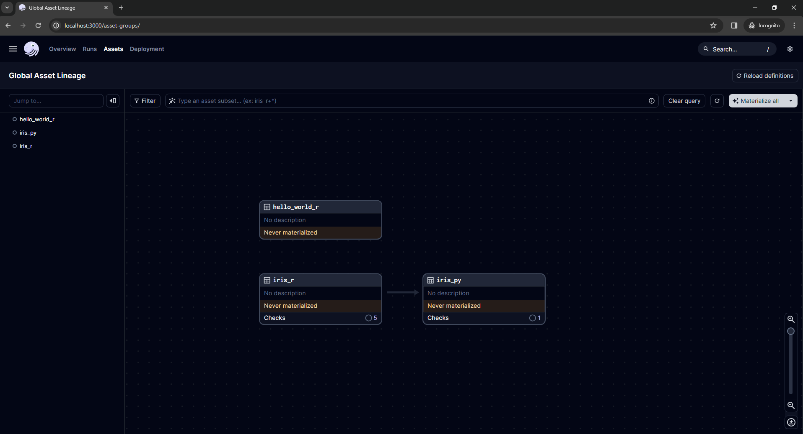
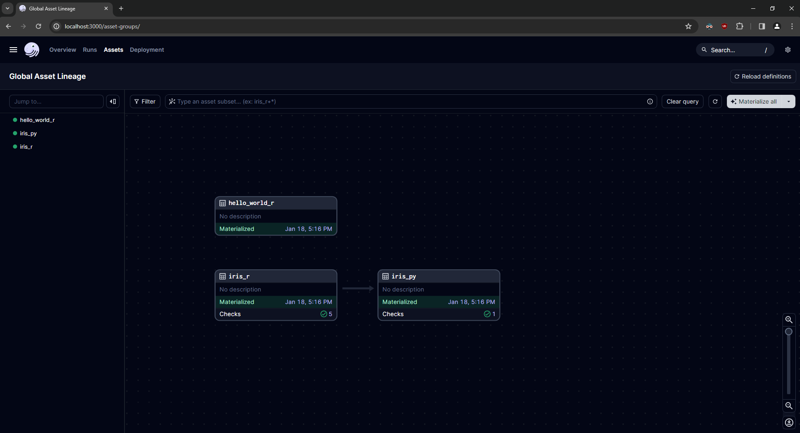
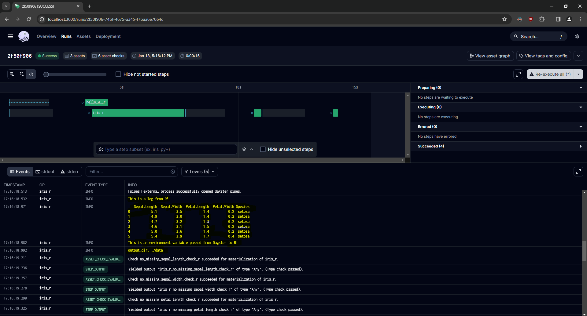

# dagster_and_r

Exploring the synergy between [Dagster](https://dagster.io/), a modern data orchestrator, and R, a powerful statistical programming language. This project showcases how business logic written in R can be integrated seamlessly within the Dagster framework. 

## Key Features

- **Docker Integration**: Execute R code in isolated environments using [Docker container ops](https://docs.dagster.io/_apidocs/libraries/dagster-docker).
- **Dagster Pipes**: Run R scripts within a subprocess, leveraging Dagster's experimental [Pipes](https://docs.dagster.io/_apidocs/pipes#pipes) feature.
- **Reticulate Bridge**: Utilize the [{reticulate}](https://rstudio.github.io/reticulate/) R package to create a bridge between Python and R, enhancing interoperability.

## Getting started

To begin exploring the integration of Dagster and R:

1. **Clone the Repository**
   ```bash
   git clone https://github.com/philiporlando/dagster-and-r.git
   ```
2. **Navigate to Directory**
   ```bash
   cd dagster-and-r
   ```
3. **Install Python Dependencies**
   # you'll need a version of python installed
   Using uv
   # install uv
   # curl -LsSf https://astral.sh/uv/install.sh | sh
   uv venv
   source .venv/bin/activate
   uv sync
   ```
4. ** Install R dependencies**
```
   # from R
   # if you haven't installed renv before
   # install.packages("renv")
   # renv::restore() 
```

4. **Set RETICULATE_PYTHON environment variable** 
Determine the path to the python binary associated with this project's poetry environment.
   ```bash
   # from your viritual environment
   which python
   # /home/user/.cache/pypoetry/virtualenvs/dagster-and-r-kS5e8P_l-py3.10/bin/python
   ```
Create a new `.Renviron` file at the root of the project and set the `RETICULATE_PYTHON` variable to this path.

5. **Launch the Dagster UI**
   Start the Dagster web server:
   ```bash
   dagster dev
   ```
   Access the UI at http://localhost:3000 in your browser.



6. **Materialize Assets** 
   Click the "Materialize all" button in the top right of the UI. Each of the assets within this project should materialize without error. 

   

7. **Inspect the Run**
   Click the "Runs" tab and navigate to the latest run of the pipeline to access detailed information, including custom logs, asset checks, and environment variables being passed from an external R session.

   

8. **Create Assets**
   Begin writing assets in `dagster_and_r/assets.py`. They are automatically loaded into the Dagster code location.


Then, start the Dagster UI web server:

```bash
dagster dev -m dagster_and_r
```

Open http://localhost:3000 with your browser to see the project.

## Current Integrations

### Dagster Pipes

- [x] Pass logs between an external R session and Dagster
- [x] Pass environment variables and context between an external R session and Dagster
- [x] Asset checks defined in R
- [ ] [In-memory data passing](https://github.com/dagster-io/dagster/discussions/18972#discussioncomment-8113649) 
- [ ] Pass markdown metadata between R and Dagster (e.g. `head()` of a data.frame))

### Docker Container Op

- [x] Execute external R code from a Docker container op. 

## Development Guide

### Adding Python Dependencies
To add new Python packages to the project:
```bash
uv add <pkg-name>
```

### Unit Testing
Unit tests are essential for ensuring code reliability and are currently being developed. Run existing tests using `pytest`:
```bash
pytest dagster_and_r_tests
```
> [!NOTE]
> Unit tests are a work in progress.

### Schedules and Sensors
To enable [Schedules](https://docs.dagster.io/concepts/partitions-schedules-sensors/schedules) and [Sensors](https://docs.dagster.io/concepts/partitions-schedules-sensors/sensors), ensure the [Dagster Daemon](https://docs.dagster.io/deployment/dagster-daemon) is active:
```bash
dagster dev
```
With the Daemon running, you can start using schedules and sensors for your jobs.


## Using pins

[Pins] provides a way to publish and cache datasets, model objects, and other intermediate objects to a variety of storage backends. Post Connect, which is a great way to publish shiny dashboards and Quarto documents. From the [Posit Connect docs](https://docs.posit.co/connect/user/pins/#:~:text=Publishing%20data%20as%20pins%20is,need%20to%20be%20regularly%20updated.):

> Publishing data as pins is useful in many situations, for example:
> 1.  Multiple pieces of content require the same input data. Rather than copying that data, each piece of content references a single source of truth hosted on Connect.
> 2. Content depends on data or model objects that need to be regularly updated. Rather than redeploying the content each time the data changes, use a pinned resource and update only the data. The data update can occur using a scheduled R Markdown document. Your content reads the newest data on each run.

One challenge with pins is that you need a script to create the pin, which feels more like a traditional data pipeline, within a separate Quarto document. 

Enter **Dagster**. With Dagster you can have the publishing of the pin as the final step in a pipeline, and then the downstream R report can reference it.

But wait, there's more! Using Dagster's environment-aware resources, you can develop locally with pins against a file system, and then move into publishing a pin on Posit Connect in production.
 
## Contributions
Contributions to enhance or expand the project are welcome! Feel free to fork the repository, make changes, and submit a pull request.
